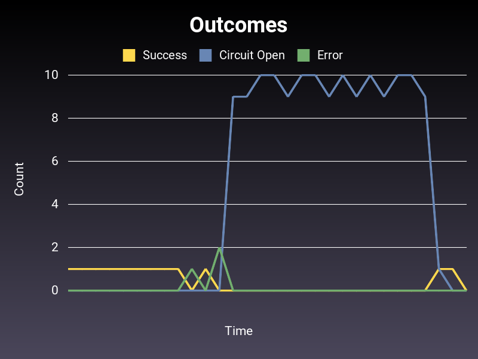

# Semian Experimental Resource

This directory contains an experimental resource adapter for running complex experiments with Semian.

## Overview

The `ExperimentalResource` class simulates a distributed service with multiple endpoints, each with configurable latencies following statistical distributions. This allows for testing various failure scenarios and performance characteristics.

## Features

### Current Implementation

1. **Multiple Endpoints**: Configure any number of endpoints, each with its own fixed latency
2. **Statistical Distributions**: Latencies are assigned based on statistical distributions
   - Currently supports: Log-normal distribution
3. **Latency Bounds**: Set minimum and maximum latency constraints
4. **Fixed Latencies**: Each endpoint gets a fixed latency at initialization for consistent behavior
5. **Request Timeouts**: Configure a maximum timeout for requests
   - Requests that would exceed the timeout sleep for the timeout period then raise an exception
   - Useful for simulating real-world timeout behavior
6. **Baseline Error Rate**: Configure a probability of request failure
   - Requests fail randomly based on the configured error rate
   - Failed requests throw `RequestError` exceptions after partial processing
7. **Service-Wide Degradation**: Degrade the entire service with optional ramp-up time
   - **Latency degradation**: Add fixed latency to all requests
   - **Error rate changes**: Modify error rate for the entire service
   - **Gradual ramp-up**: Both degradations support gradual transitions over time

## Usage

See `example_with_circuit_breaker.rb` for usage:

```
bundle install
bundle exec ruby example_with_circuit_breaker.rb
```

Output:


