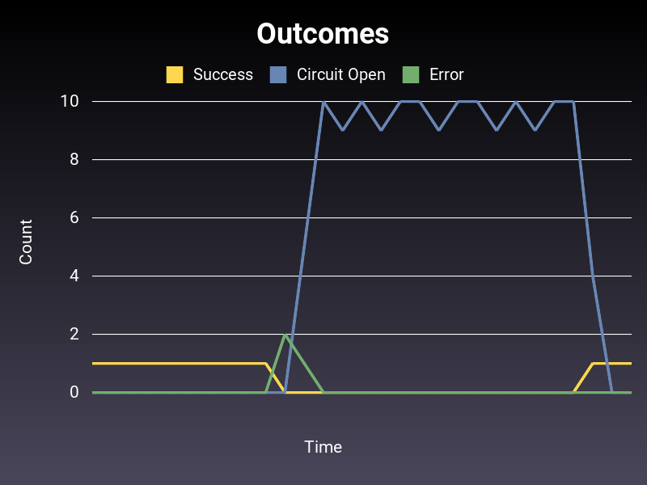

# Semian Experimental Resource

This directory contains an experimental resource adapter for running complex experiments with Semian.

## Overview

The `ExperimentalResource` class simulates a distributed service with multiple endpoints, each with configurable latencies following statistical distributions. This allows for testing various failure scenarios and performance characteristics.

## Features

### Current Implementation

1. **Multiple Endpoints**: Configure any number of endpoints, each with its own fixed latency
2. **Statistical Distributions**: Latencies are assigned based on statistical distributions
   - Currently supports: Log-normal distribution
3. **Latency Bounds**: Set minimum and maximum latency constraints
4. **Fixed Latencies**: Each endpoint gets a fixed latency at initialization for consistent behavior
5. **Request Timeouts**: Configure a maximum timeout for requests
   - Requests that would exceed the timeout sleep for the timeout period then raise an exception
   - Useful for simulating real-world timeout behavior
6. **Baseline Error Rate**: Configure a probability of request failure
   - Requests fail randomly based on the configured error rate
   - Failed requests throw `RequestError` exceptions after partial processing
7. **Service-Wide Degradation**: Degrade the entire service with optional ramp-up time
   - **Latency degradation**: Add fixed latency to all requests
   - **Error rate changes**: Modify error rate for the entire service
   - **Gradual ramp-up**: Both degradations support gradual transitions over time
8. **Traffic Replay Mode**: Replay real production traffic patterns from Grafana exports
   - Load latency patterns from JSON log files
   - Simulate requests as though an incident were happening in real-time
   - Automatically stops when the timeline is exceeded

## Usage

### Synthetic Traffic Generation

See `example_with_circuit_breaker.rb` for usage:

```
bundle install
bundle exec ruby example_with_circuit_breaker.rb
```

Output:



### Traffic Replay Mode

The traffic replay feature allows you to simulate real production incidents by replaying latency patterns from Grafana exports.

#### How It Works

1. Export traffic data from Grafana as JSON (one JSON object per line)
2. Initialize the resource with `traffic_log_path` parameter
3. The service will simulate latencies based on elapsed time since initialization
4. When a request comes in at time T seconds after service start, it uses the latency from the log entry at offset T
5. When the service has been running longer than the log timeline, it stops accepting requests

#### Required JSON Format

Each line in the JSON file should be a complete JSON object with:
- `timestamp`: ISO8601 timestamp (e.g., `"2025-10-02T16:19:30.814890047Z"`)
- `attrs.db.sql.total_duration_ms`: Database latency in milliseconds

Example:
```json
{"timestamp": "2025-10-02T16:19:30.814890047Z", "attrs.db.sql.total_duration_ms": 2.5, "attrs.db.sql.total_count": 1}
{"timestamp": "2025-10-02T16:19:31.314890047Z", "attrs.db.sql.total_duration_ms": 5.8, "attrs.db.sql.total_count": 2}
{"timestamp": "2025-10-02T16:19:31.814890047Z", "attrs.db.sql.total_duration_ms": 12.3, "attrs.db.sql.total_count": 3}
```

If a request doesn't have `attrs.db.sql.total_duration_ms`, it's treated as 0ms latency.

#### Example Usage

```ruby
resource = Semian::Experiments::ExperimentalResource.new(
  name: "my_service",
  endpoints_count: 1,
  min_latency: 0.0,
  max_latency: 1.0,
  distribution: { type: :log_normal, mean: 0.1, std_dev: 0.05 },
  timeout: 30.0,
  traffic_log_path: "path/to/grafana_export.json",  # Enable traffic replay
  semian: {
    circuit_breaker: true,
    success_threshold: 2,
    error_threshold: 3,
    error_threshold_timeout: 10,
  }
)

# Make requests - they'll be served with latencies from the log
begin
  resource.request(0) do |endpoint, latency|
    puts "Request completed with latency: #{(latency * 1000).round(2)}ms"
  end
rescue Semian::Experiments::ExperimentalResource::TrafficReplayCompleteError
  puts "Traffic replay completed!"
end
```

#### Running the Example

A complete example with a sample traffic log is provided:

```bash
bundle exec ruby example_with_traffic_replay.rb sample_traffic_log.json
```

The sample log simulates a 12-second incident where latency spikes from ~2ms to over 300ms and then recovers.
